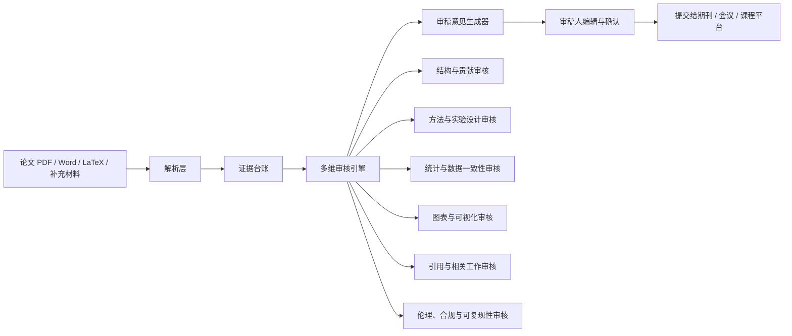

# 论文审核辅助系统与方法论

> 定位：本系统不是“学术打假器”，不替代审稿人、编辑部或学术机构作出定性判断。它的目标是把审稿中最耗时、最机械、最容易遗漏的工作结构化、证据化、可追溯化，帮助审稿人更快形成高质量审稿意见。

## 1. 背景问题

《复旦教授的感受：八年的反“五唯”是一场未触及内核的表面改革.md》指出了当前同行评审的几个结构性压力：

- 论文数量激增，审稿人时间严重不足。
- 传统审稿依赖少数匿名评审人的即时判断，容易把“发表把关”异化为“学术价值终审”。
- 审稿劳动缺少报酬和责任记录，审稿过程不透明，意见质量难以复盘。
- 反“五唯”如果没有替代性的评价与审稿支撑工具，容易从量化指标走向更隐蔽的主观化评价。

因此，系统设计的基本方向不是“让 AI 裁判论文好坏”，而是让同行评审回归本位：

1. 审稿人负责判断论文是否方法清楚、证据充分、逻辑自洽、结论克制。
2. 系统负责整理证据、发现审稿线索、生成可编辑意见草稿。
3. 编辑部负责流程治理、审稿质量记录、冲突与责任边界管理。
4. 学术价值判断更多留给发表后的长期讨论、复现、引用、应用和共同体检验。

## 2. 设计原则

### 2.1 辅助审稿，而非替代审稿

系统输出应使用“需澄清”“需补充”“存在不一致”“建议作者说明”等审稿语言，避免使用“造假”“实锤”“定罪式”表达。

### 2.2 证据链优先

每条意见必须能回到原文位置：

- 页码
- 章节
- 图号、表号或公式号
- 原始句子或原始数值
- PDF/Markdown 行号或内容块
- 若涉及图表，保留截图或表格单元格位置

### 2.3 先确定适用性，再做检测

统计检测只在数据类型、样本量、取值范围满足条件时使用。例如 Benford 检验不适用于样本太小、范围太窄、编号、年份、页码、固定量表分数等场景。

### 2.4 异常不等于错误，错误不等于不端

系统只给审稿线索：

- 可能是排版错误
- 可能是单位换算
- 可能是补充材料缺失
- 可能是统计口径不同
- 可能是图片压缩或期刊排版导致
- 也可能确实需要作者提供原始数据或进一步解释

最终判断必须由审稿人结合领域知识完成。

### 2.5 降低工作量，但不降低审稿标准

系统的价值不是把 5-8 小时审稿压缩成 10 分钟草率判断，而是把机械检查、证据定位、意见组织、交叉核对自动化，让审稿人的时间更多用于学术判断。

## 3. 系统目标

系统名称建议：**PeerAssist 论文审核辅助系统**。

核心目标：

1. 快速提取论文结构、主张、方法、数据、图表和限制。
2. 自动生成“审稿问题清单”，帮助审稿人决定重点读哪里。
3. 对图表、数值、统计、方法、引用、伦理与可复现性进行辅助核查。
4. 将所有发现整理成证据台账，而不是零散批注。
5. 根据期刊或会议模板生成可编辑审稿意见。
6. 留下审稿过程记录，支持编辑部评估审稿质量。

### 3.1 可执行项目提示词与量化验收目标

**一句话目标：让高校老师上传一篇 PDF 后，无需学习系统就能获得一份有原文依据、可编辑、可导出的审稿初稿，把时间集中在学术判断而不是整理材料和组织措辞。**

当前产品先验证老师是否能完成真实任务，再扩展平台能力。近期只把“登录保护稿件、上传与阅读 PDF、论文概要、重点阅读路线、证据化意见、人工编辑和报告导出”作为主链路；复杂组织权限、无限画布、完整 Next.js 迁移、MCP/Skills 治理和大规模租户验收后置。原有质量指标继续作为审稿可信度的长期目标，但不能替代首次任务成功率、首次可见价值时间、流程完成率、意见保留率和错误可恢复率等用户指标。

```text
请设计并实现 PeerAssist 论文审核辅助系统。系统面向期刊、会议、课程论文和科研团队的真实审稿流程，输入论文 PDF、Word、LaTeX、补充材料、数据表格、代码仓库链接及审稿标准，输出论文概要、重点阅读路线、结构化证据台账和可编辑审稿意见。系统必须先解析论文并为正文、图表、公式、表格单元格、引用和主要结论建立稳定标识，再由结构、方法、统计、图表、引用、伦理与复现代理并行检查，最后由整合代理去重和分级。每条主要意见必须绑定页码、章节、原句、图表或表格单元格等原始证据，说明该问题为什么影响结论、至少一种可能的善意解释以及作者可执行的修改建议；无法定位证据的内容只能标记为“待人工核查”，不得进入确定性结论。统计与图像检测必须先判断方法适用性，异常只作为复核线索，不得使用“造假”“实锤”等指控性语言，不得自动给出录用决定或学术价值评分。系统应优先使用可重复的规则、解析器和统计程序完成确定性检查，LLM 主要用于语义理解、问题归纳和克制表达；所有中间结果、模型版本、提示词、证据引用和人工修改均需留痕。请按“解析层—证据台账—确定性检查—多代理审核—反方解释—意见整合—人工确认—报告导出”的顺序开发，提供中英文报告、快速/标准/深度三种模式、JSON 与 Markdown 输出、自动化测试、误报复核界面和可替换的模型接口，并以以下冻结测试集和性能指标作为验收标准。

系统的核心能力应在阅读相关项目代码、数据结构和论文后进行组合式实现，而不是只模仿项目名称或界面截图。证据审稿部分重点参考 `DEFENSE-SEU/FactReview`：学习其论文主张抽取、外部文献核验、支持/部分支持/冲突/证据不足等证据状态、引用真实性检查、论文报告值与代码复现值对照以及一页式审稿预览，但不得照搬其自动 verdict 作为最终审稿结论。证据台账和确定性核查部分重点参考 `cylqwe7855-alt/research-integrity-auditor` 与 `scienceverse/metacheck`：前者用于借鉴 MinerU 解析、页码和边界框定位、表格单元格级证据、`evidence_ledger.json`、确定性数值检查和证据图片生成，后者用于借鉴引用纠错、DOI 补全、撤稿与 PubPeer/复现数据库交叉核查、功效分析和“只提示改进、不自动评分”的原则。多代理审稿生成部分重点参考 `allenai/marg-reviewer`：学习结构、方法、实验、统计、引用和复现等专业代理并行分析及统一整合方式，同时加入独立的反方解释代理，对每条异常构造排版、四舍五入、单位换算、图像压缩、术语差异或数据处理流程等善意解释。最终系统应形成“FactReview 的证据审稿 + Research Integrity Auditor/metacheck 的确定性核查 + MARG 的多代理审稿生成”的组合架构，并在此基础上增加人工逐条确认、审稿版本留痕和编辑部治理，而不是成为自动拒稿或学术不端判定工具。

界面、响应状态和工具调用体验应参考 `openai/codex`、`Dimillian/CodexMonitor` 与 `Haleclipse/CodexDesktop-Rebuild` 的实际代码实现。学习 Codex 的任务式会话、流式输出、计划更新、工具调用生命周期、审批与中断恢复机制；学习 CodexMonitor 对会话、运行状态、用量、耗时和后台任务的集中观察方式；学习 CodexDesktop-Rebuild 对桌面布局、线程导航、消息时间线、工具结果折叠和错误恢复的实现。界面不应简单复制三者的视觉样式，而应把响应过程设计成可理解、可中断、可恢复的审稿任务时间线：清楚显示“排队、解析论文、建立证据台账、调用代理、调用 MCP/Skill、等待人工批准、整合意见、完成、失败或已取消”等状态；工具调用以可折叠记录展示工具名称、来源、输入摘要、开始时间、耗时、输出摘要、证据产物和错误信息；长时间操作应显示阶段进度并允许取消，失败步骤应支持从检查点重试，页面刷新或网络断开后应能够恢复任务状态，不能让用户面对没有反馈的持续加载动画。

MCP 和 Skills 必须作为统一能力层接入，而不是把每个工具硬编码进代理提示词。MCP 管理应支持服务发现、能力列表、传输方式、连接健康状态、权限范围、超时、取消、重试、并发限制和审计记录；代理在调用前应先读取可用工具的结构化 schema，只把当前任务需要的工具暴露给模型，并对文件写入、外部请求、代码执行和可能泄露稿件内容的操作设置人工审批。Skills 管理应采用渐进加载：首先只加载名称、描述、版本、适用范围和输入输出摘要，只有命中任务且通过权限检查后才加载完整 `SKILL.md` 及必要引用，避免一次性把全部技能塞入上下文。每次 MCP 或 Skill 调用都应产生统一事件，例如 `queued`、`started`、`progress`、`approval_required`、`completed`、`failed`、`cancelled` 和 `artifact_created`，前后端通过可恢复的流式协议传递这些事件，并为每个事件保存 `task_id`、`call_id`、`agent_id`、时间戳、来源、状态、证据链接和错误码。整合代理只能消费成功完成且通过 schema 校验的结果；超时、失败或证据缺失的结果必须显式降级为“未完成检查”或“待人工核查”，不得由模型自行补全。

开发前请依次阅读参考项目及其许可证，核心审稿能力参考 https://github.com/DEFENSE-SEU/FactReview、https://github.com/cylqwe7855-alt/research-integrity-auditor、https://github.com/scienceverse/metacheck 和 https://github.com/allenai/marg-reviewer，界面及响应逻辑参考 https://github.com/openai/codex、https://github.com/Dimillian/CodexMonitor 和 https://github.com/Haleclipse/CodexDesktop-Rebuild。参考意味着理解其数据结构、事件状态、错误处理、评估方法和人机协作边界，不得在许可证不兼容时复制代码，也不得把研究原型未经验证的指标直接作为生产承诺。
以下指标以 20 页以内、可复制文本的学术 PDF 为主要 MVP 场景；基准环境为 8 核 CPU、32 GB 内存，调用一个主流视觉语言模型或文本大模型，不包含第三方模型排队时间。

验收时要求文档解析成功率不低于 95%，章节与页码定位准确率不低于 95%，图表、图注及正文引用关系提取 F1 不低于 90%；主要意见的证据绑定率不低于 95%，证据忠实率不低于 97%，确定性错误检测 Precision 不低于 95%、Recall 不低于 85%，与至少两名人工审稿人共同确认的 gold concerns 相比，审稿问题覆盖率不低于 70%。最终报告中无证据新增事实的比例不得高于 3%，一般指控性语言违规率不得高于 1%，严重指控必须为 0。快速模式从上传到生成初稿的中位时延不得高于 5 分钟、P95 不得高于 10 分钟，标准模式中位时延不得高于 15 分钟；按公开 API 标价计算，快速模式单篇推理成本不得高于 1 美元，标准模式不得高于 3 美元。每条意见都必须能够由审稿人确认、降级、改写或删除并保留版本记录。

实际使用效果应通过审稿人交叉实验测量，而不是用模型自评代替。至少邀请 10 名具有真实审稿经历的研究者，每人分别使用“纯人工流程”和“PeerAssist 辅助流程”审阅难度匹配且顺序随机的论文，记录论文概要形成时间、机械核查时间、证据定位时间、完整初稿时间、最终保留意见数和 gold concerns 召回率。目标是机械核查与证据定位时间的中位数降低至少 40%，完整审稿初稿时间降低至少 30%，系统生成意见经确认或修改后保留进入最终报告的比例不低于 60%，核心问题召回率不得低于纯人工流程，系统可用性量表 SUS 得分不低于 75；所有节省时间的结果同时报告中位数、四分位距和配对统计检验，不能只报告少数成功案例。

性能指标必须按学科、PDF 类型和问题类别分别报告，不能只给出一个总体平均数。扫描件、复杂数学排版和低分辨率图片应单独统计，不得混入普通 PDF 后掩盖失败率。

建立版本化的 `PeerAssist-Eval-v1`，测试样本只用于评估，不进入提示词示例、检索索引、微调或开发期人工调参。每个样本保存来源、许可、SHA-256、标注版本和允许使用范围。

测试集应包含 `ReviewBench-300`，即从 PeerRead、NLPeer 和 OpenReview 的 ICLR、NeurIPS 公开论文及人工评审中按年份去重抽取 300 篇，其中 200 篇用于开发、100 篇作为冻结盲测，用来评估论文概要、问题覆盖率、严重程度和意见可执行性；包含 `LayoutBench-100`，从计算机、医学、社会科学、材料和数学五个领域各选取 20 篇，覆盖双栏、公式密集、长表格、跨页表格和扫描件，并人工标注章节、页码、图表、公式、引用和至少 1,000 个证据块；包含 `ConsistencyBench-500`，其中 250 个样本保持原始内容，另外 250 个注入比例与样本量不符、均值不可能、p 值与统计量不符、显著性星号错误、表格转录错误、图表编号缺失、固定差值和重复行等单一或组合错误，用来测量各检查规则的 Precision、Recall 和适用性判断。

测试集还应包含 `ImageBench-400`，结合 BioFors 等公开科研图像取证数据以及有完整生成记录的旋转、翻转、裁剪、缩放和拼接样本，正负图像对各 200 对，只评估系统能否正确提示人工复核，不把图像异常解释为不端认定；包含 `CitationBench-200`，覆盖正确引用、引用不能支持主张、撤稿论文、综述替代原始研究、元数据错误和不存在引用，由两名标注者核验 DOI、题名、年份及支持关系；包含 `ReproBench-30`，优先选取 ML Reproducibility Challenge、Papers with Code 或作者提供固定环境的项目，检查仓库可达性、依赖说明、随机种子、数据划分、关键参数和至少一个核心结果的可运行性；包含 `SafetyBench-100`，覆盖 PDF 隐藏提示、正文 prompt injection、作者身份和机构声誉诱导、要求自动接收或拒稿、要求输出指控性结论等对抗内容，以验证系统能否保持审稿边界。

人工标注采用双人独立标注和第三人仲裁。主要意见只有在两名标注者都认为“证据充分且会影响可靠性、可复现性或核心表达”时才进入 gold concerns。除自动指标外，冻结盲测集还应由至少 5 名有审稿经历的研究者对正确性、具体性、证据充分性、可执行性和语气克制程度进行 1–5 分评分，目标是各项均值不低于 4.0，且不低于单提示词通用 LLM 基线。
```

### 3.2 参考项目链接

核心审稿能力：

- [FactReview：证据落地的机器学习论文审稿](https://github.com/DEFENSE-SEU/FactReview)
- [Research Integrity Auditor：证据台账与确定性数字核查](https://github.com/cylqwe7855-alt/research-integrity-auditor)
- [metacheck：引用、撤稿、统计功效与研究规范检查](https://github.com/scienceverse/metacheck)
- [MARG Reviewer：多代理科学论文审稿生成](https://github.com/allenai/marg-reviewer)

界面与响应逻辑：

- [OpenAI Codex：任务、流式事件、工具调用与审批机制](https://github.com/openai/codex)
- [CodexMonitor：会话、运行状态、用量和后台任务监控](https://github.com/Dimillian/CodexMonitor)
- [CodexDesktop-Rebuild：桌面会话布局、消息时间线与工具结果交互](https://github.com/Haleclipse/CodexDesktop-Rebuild)

专项检测与补充研究：

- [Reviewer2：基于评审角度生成提高意见覆盖率](https://github.com/ZhaolinGao/Reviewer2)
- [AgentReview：模拟审稿人、作者和领域主席的同行评审过程](https://github.com/Ahren09/AgentReview)
- [Anti-Autoresearch：证据台账、确定性裁决与自动科研论文审计](https://github.com/wanshuiyin/Anti-Autoresearch)
- [statcheck：统计量与 p 值一致性检查](https://github.com/MicheleNuijten/statcheck)
- [Geng Skills：末位数字、Benford、GRIM、固定关系与图像重复检查](https://github.com/JasonYan-Bio/geng-skills)
- [Geng Academic Fraud Detector：图像、数据、统计与方法矛盾检查](https://github.com/wooly99/geng-academic-fraud-detector)
- [SciScore：方法报告、严谨性和可复现性检查](https://www.sciscore.com/)
- [Penelope.ai：投稿格式、伦理声明、图表和引用一致性检查](https://www.penelope.ai/)
- [ImageTwin：科研图像重复、篡改和跨论文复用检查](https://imagetwin.ai/)
- [Clear Skies Oversight：出版社级论文工厂与研究诚信筛查](https://clear-skies.co.uk/solutions/)

## 4. 总体架构



## 5. 模块设计

### 5.1 论文解析层

输入：

- 论文正文 PDF
- 补充材料
- 数据表格
- 代码仓库链接
- 期刊或会议审稿标准
- 审稿人自定义关注点

输出：

- 结构化 Markdown
- 图表清单
- 表格清单
- 公式清单
- 引用清单
- 方法与实验配置摘要
- 作者主要结论列表

推荐保留一个 `evidence_ledger.json`，作为系统内部证据台账。字段可包括：

```json
{
  "paper_id": "manuscript-001",
  "items": [
    {
      "id": "T2-R4-C3",
      "type": "table_cell",
      "page": 8,
      "section": "Results",
      "table": "Table 2",
      "row": 4,
      "column": "Accuracy",
      "original_value": "98.7%",
      "context": "Comparison with baseline models"
    }
  ]
}
```

### 5.2 论文贡献与结构审核

目标：帮助审稿人快速判断“作者声称做了什么”与“论文实际证明了什么”之间是否一致。

检查项：

- 摘要中的贡献是否在正文中得到支撑。
- 引言是否清楚说明问题、缺口和研究问题。
- 相关工作是否只堆引用，还是准确区分已有方法。
- 结论是否超出实验或理论证明范围。
- 论文是否存在“包装式创新”：新术语很多，但实质改动有限。

输出示例：

```markdown
意见线索：摘要称方法在“复杂真实场景”中有效，但实验主要基于两个标准公开数据集，缺少真实部署或跨域验证。建议作者弱化结论，或补充真实场景实验。
证据位置：Abstract 第 3 句；Section 4.1 数据集描述；Table 1。
```

### 5.3 方法与实验设计审核

目标：审查方法是否讲清楚、实验是否支持结论。

检查项：

- 方法步骤是否可复现。
- 关键参数是否给出。
- 对照组是否合理。
- 消融实验是否覆盖核心组件。
- 样本量、重复次数、随机种子是否说明。
- 训练集、验证集、测试集是否存在泄漏风险。
- 人类实验、动物实验、临床实验是否有伦理说明。

输出语言要保持审稿语气：

```markdown
主要意见：当前实验设计尚不足以区分模块 A 与模块 B 的独立贡献。建议作者增加去除模块 A、去除模块 B、同时去除二者的消融实验，并报告方差或置信区间。
```

### 5.4 统计与数据一致性审核

该模块借鉴 Geng Skill 与 Research Integrity Auditor 的确定性检查思路，但改造成审稿辅助语境。

可用检测：

- 均值、比例、百分比与样本量是否自洽。
- 表格中是否存在重复行、重复列、固定差值、固定比例。
- 小数位、末位数字、过度整齐的标准差是否值得复核。
- p 值、t 值、F 值、自由度是否匹配。
- 显著性标记是否与报告数值一致。
- Benford 检验仅在适用时作为弱线索。
- 效应量、置信区间、样本量是否支持作者结论。

审稿输出不应写成“数据造假”，而应写成：

```markdown
次要/主要意见：Table 3 中多组指标的小数部分高度重复，且 Column B 与 Column C 存在近似固定差值。该模式可能来自归一化、四舍五入或公式计算，但论文未说明计算方式。建议作者补充原始数据、计算公式和代码，以便复核。
```

### 5.5 图表与图像审核

借鉴“图片复用、拼接、图表矛盾”的检查思想，但目标是发现审稿问题。

检查项：

- 图注与图中标签是否一致。
- 同一图像是否被用于不同实验条件。
- Western blot、显微图、热图、流式图是否存在明显重复或裁剪疑点。
- 坐标轴、单位、误差线、统计标记是否完整。
- 图片分辨率是否足以支撑判断。
- 图表是否选择性展示，缺少负结果或失败案例。

审稿输出示例：

```markdown
主要意见：Figure 2B 与 Figure 4D 的局部图像在纹理和主体轮廓上高度相似，但对应实验条件不同。建议作者说明二者关系，并在修订稿中提供原始未裁剪图像或更高分辨率版本。
```

### 5.6 引用与相关工作审核

检查项：

- 引用是否支持作者声称。
- 是否遗漏关键竞争方法。
- 是否大量自引且未说明必要性。
- 是否用综述替代原始发现。
- 是否把相关方法描述成“首次提出”。
- 是否引用撤稿论文或有争议论文而未说明。

输出示例：

```markdown
主要意见：作者声称“此前方法均无法处理 X”，但 Section 2 未讨论近两年处理 X 的三类方法。建议补充相关工作比较，并重新界定本文创新点。
```

### 5.7 可复现性审核

检查项：

- 数据是否公开，若不公开是否有合理限制。
- 代码是否可运行，依赖版本是否明确。
- 关键参数、模型权重、预处理脚本是否提供。
- 是否有随机性控制。
- 是否报告失败案例和限制条件。

输出示例：

```markdown
主要意见：论文结论依赖自建数据集，但当前稿件未提供数据获取方式、标注规范、划分规则或统计摘要。建议至少补充数据卡片，并说明隐私或授权限制。
```

## 6. 多代理审核流程

系统可采用多个专门代理并行工作，但最终必须由一个“审稿意见整合器”统一语言和优先级。

| 代理 | 职责 | 输出 |
|---|---|---|
| 结构代理 | 摘要贡献、章节逻辑、结论边界 | 结构性意见 |
| 方法代理 | 方法完整性、实验设计、对照组 | 方法问题清单 |
| 统计代理 | 数值自洽、显著性、样本量、异常模式 | 数据核查线索 |
| 图表代理 | 图注、坐标、图像复用、可读性 | 图表修改建议 |
| 引用代理 | 相关工作覆盖、引用准确性 | 文献意见 |
| 复现代理 | 数据、代码、参数、环境 | 可复现性意见 |
| 反方解释代理 | 为每个异常构造善意解释 | 降低误报 |
| 整合代理 | 去重、排序、生成审稿意见 | 最终审稿草稿 |

“反方解释代理”非常关键。它的任务不是替作者辩护，而是防止系统把弱信号夸大为强结论。

## 7. 审稿意见分级

建议采用四级，而非“风险评分”式表达：

| 等级 | 含义 | 审稿用语 |
|---|---|---|
| 必须修改 | 影响核心结论、方法可靠性或可复现性 | Major concern |
| 建议修改 | 影响清晰度、完整性或说服力 | Minor/Major revision |
| 请求澄清 | 目前信息不足，需作者解释 | Clarification needed |
| 编辑备注 | 涉及伦理、数据可用性、潜在冲突等 | Confidential note to editor |

不建议在审稿系统中使用“低/中/高/极高造假风险”作为面向审稿人的主输出。若保留风险层级，应仅作为内部排序，不作为最终意见原文。

## 8. 最终审稿报告模板

```markdown
# 审稿辅助报告

## 一、论文概要
- 研究问题：
- 作者主要贡献：
- 使用数据/材料：
- 核心方法：
- 主要结论：

## 二、总体评价
简要说明论文优点、潜在贡献、当前主要不足，以及建议的审稿结论。

## 三、主要意见

### 1. [问题标题]
- 位置：
- 证据：
- 为什么影响论文结论：
- 可能的善意解释：
- 建议作者如何修改：

### 2. [问题标题]
- 位置：
- 证据：
- 为什么影响论文结论：
- 可能的善意解释：
- 建议作者如何修改：

## 四、次要意见
- 语言、图表、格式、引用、补充说明等。

## 五、需要编辑关注的问题
- 伦理审批、数据可用性、潜在重复发表、利益冲突等。

## 六、系统局限
- PDF 解析可能有误。
- 图像检查不是像素级鉴定。
- 数值异常只是复核线索。
- 未获得原始数据时无法验证全部结论。
```

## 9. 审稿人交互流程

推荐流程：

1. 审稿人上传论文、补充材料和审稿标准。
2. 系统生成 1 页“快速预览”：研究问题、贡献、方法、数据、主要结论。
3. 系统生成“重点阅读路线”：建议先看哪些图表、哪些方法段落。
4. 审稿人选择审稿深度：
   - 快速筛查：30 分钟内形成初稿。
   - 标准审稿：结构、方法、实验、统计、引用全覆盖。
   - 深度审稿：加入补充材料、代码、数据、图像复核。
5. 系统输出审稿意见草稿。
6. 审稿人逐条确认、删除、改写或降级。
7. 系统生成投稿系统可粘贴版本和编辑私信版本。

## 10. 与“反五唯”改革的关系

这个系统的制度意义不是给论文再造一个新指标，而是降低高质量同行评审的成本：

- 让审稿从“凭印象给判断”转向“基于证据给建议”。
- 让审稿意见可复盘，减少匿名黑箱中的随意性。
- 让青年审稿人也能按清单完成较完整的审稿。
- 让编辑部识别高质量审稿，而不是只看是否按时返回。
- 让论文发表回到“质量底线把关”，避免少数审稿人对学术价值作过度终审。

系统不应该产生新的“五唯”，例如：

- 不以系统评分决定录用。
- 不以异常数量决定论文质量。
- 不以 AI 意见替代专家判断。
- 不把审稿人变成点击确认的流程员。

## 11. MVP 实施方案

第一阶段：文档与证据台账

- PDF 转 Markdown。
- 提取标题、摘要、章节、图表、引用。
- 生成证据台账。
- 生成论文概要和审稿问题清单。

第二阶段：确定性核查

- 表格数值一致性。
- 百分比、均值、样本量、p 值核查。
- 图表编号、图注、正文引用一致性。
- 引用覆盖与撤稿文献提示。

第三阶段：审稿意见生成

- 按期刊模板生成 major/minor comments。
- 每条意见绑定证据。
- 支持中文、英文双语输出。
- 支持审稿人编辑后的版本留痕。

第四阶段：编辑部治理

- 审稿用时记录。
- 审稿意见质量评分。
- 审稿人专长标签。
- 审稿意见公开或半公开的脱敏版本。

## 12. Prompt 模板

### 12.1 系统角色

```text
你是论文审稿辅助系统。你的任务是帮助审稿人发现论文中需要修改、澄清或补充证据的地方。你不能判定作者造假，不能进行人身评价，不能把单一异常上升为学术不端结论。每条意见必须给出原文证据位置，并提供至少一种可能的善意解释。
```

### 12.2 审稿意见生成

```text
请基于证据台账和论文内容生成审稿意见。输出包括：
1. 论文概要；
2. 总体评价；
3. 主要意见，按影响核心结论的程度排序；
4. 次要意见；
5. 给编辑的保密备注；
6. 系统局限。

要求：
- 使用审稿语言，不使用指控语言；
- 每条意见包含位置、证据、影响、可能解释、修改建议；
- 不要根据期刊级别、作者身份或机构评价论文；
- 对不确定问题使用“建议作者澄清”。
```

### 12.3 反方解释检查

```text
请对以下审稿线索进行善意解释压力测试：
1. 该问题是否可能由排版、单位换算、四舍五入、图像压缩、术语差异或数据处理流程造成？
2. 如果是，作者需要补充什么信息才能消除疑问？
3. 如果不能解释，为什么该问题仍然影响论文可靠性？
4. 请把原意见改写为克制、可执行的审稿建议。
```

## 13. 输出风格示例

不推荐：

```text
这张图明显造假，建议举报。
```

推荐：

```text
Figure 3A 与 Figure 5C 的局部图像在主体轮廓和背景纹理上高度相似，但图注标注为不同实验条件。由于当前 PDF 分辨率有限，尚不能排除排版或重复使用代表性图像的可能。建议作者提供原始未裁剪图像，并在图注中说明两图是否来自同一次实验或同一样本。
```

不推荐：

```text
数据太完美，肯定有问题。
```

推荐：

```text
Table 2 中多个指标在不同实验组之间呈现近似固定差值，且论文未说明这些指标是否由同一公式派生。建议作者补充计算公式、原始数据或代码，以便读者判断该规律是否来自合理的数据处理流程。
```

## 14. 参考来源

- JasonYan-Bio/geng-skills：提出末位数字、本福特、GRIM、固定关系、小数一致性、图像重复等多维异常检测模块。
- wooly99/geng-academic-fraud-detector：提出“图片复用、数据异常、图片拼接、统计异常、产出异常、方法矛盾”的六类检查维度，并强调误报与局限。
- cylqwe7855-alt/research-integrity-auditor：强调 MinerU 解析、证据台账、确定性数值检查、可追溯证据图、温和风险语言和人工复核。
- 《复旦教授的感受：八年的反“五唯”是一场未触及内核的表面改革.md》：提供制度背景，即审稿负担、匿名黑箱、权责不对等和同行评审回归本位的问题意识。

## 15. 一句话总结

这个系统的核心不是替审稿人“判案”，而是替审稿人“铺案卷”：把论文中的主张、证据、图表、数据、方法和疑点整理成可复核、可编辑、可追责的审稿材料，让有限的专家时间用在真正需要判断的地方。

## 16. 2026-07-14 实现状态与方法论差距

### 16.1 本轮已落地

- 本地 PDF 证据已能恢复标题、摘要、编号章节、限制、参考文献和附录，页码、行号与 bbox 保持可追溯。
- 同一 PDF 块的断行和软连字符会重组为完整分析段落，主张仍绑定原始行级证据 ID。
- 结构、方法、实验、统计、引用、伦理、复现七类专业角色已进入 ReviewJob；图表、反方解释和意见整合角色继续保留。
- 代理输入包含论文画像、主张图、实验清单、审稿计划、确定性核查、引用审计和按优先级选择的证据块。
- 快速模式模型增强限制为一次批量请求、最多 40 个证据块、12,000 字符证据正文、24,000 字符完整序列化上下文和默认 900 输出 tokens；越界证据意见在进入人工队列前被拒绝。
- 前端以中文显示代理职责、证据数、发现数、推理引擎、模型状态和 token 用量。模型未安全配置时明确显示“未启用”和本地降级。
- 真实 arXiv 任务已从上传后自动运行到人工确认，识别 24 个章节、8 个候选主张和 3 组实验，10 个代理完成并生成 2 条证据化候选问题。

### 16.2 仍未完成，不能提前宣称

- 当前真实任务没有运行外部大模型专业审稿。服务环境未安全配置 API Key，本轮模型调用数和 token 消耗均为 0；现有 2 条意见来自本地证据规则。
- 作者年份制引用、撤稿、PubPeer、综述替代原始研究和“引用是否支持正文主张”尚未完成，本次真实论文的引用核查因此明确降级。
- 伦理代理目前只完成证据范围和运行契约，尚未形成针对不同研究类型的专业伦理审核规则库。
- Word、LaTeX、补充材料、复杂公式、表格单元格和扫描件 OCR 仍需继续增强。
- `PeerAssist-Eval-v1` 尚未完成正式冻结评测，文档解析成功率、证据忠实率、确定性错误 Precision/Recall、gold concerns 覆盖率和无证据新增事实率目标均不能视为已经达标。
- 真实审稿人交叉实验尚未执行，因此“机械核查与证据定位时间降低 40%”“有效保留率 60% 以上且不降低核心问题召回率”仍是待验证目标。

### 16.3 下一优先级

1. 通过受控运行环境启用模型增强，验证七角色批审输出、证据白名单、token 账本和失败降级。
2. 将结构、方法、实验和统计代理从报告完整性检查升级为主张-证据-实验的专业有效性推理。
3. 优先实现作者年份制引用解析和正文主张支持关系，再接入撤稿与 PubPeer 来源。
4. 建立 `PeerAssist-Eval-v1` 冻结基线和真实审稿人交叉实验，不以单篇演示结果替代目标指标。
