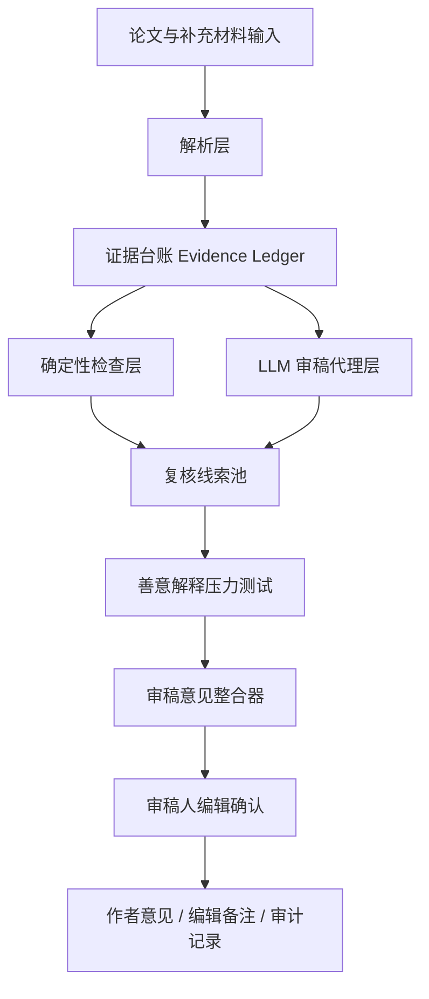

# 子代理审阅汇总

> 目的：先分别看清楚三个仓库和本地文章，再把它们转译为“论文审核/审稿辅助系统”的设计依据。这里的“审核”指辅助审稿，不指控作者，也不替代编辑部、审稿人或学术机构作最终判断。

## 1. JasonYan-Bio/geng-skills

关键来源：

- https://github.com/JasonYan-Bio/geng-skills/blob/main/SKILL.md
- https://raw.githubusercontent.com/JasonYan-Bio/geng-skills/main/SKILL.md
- https://github.com/JasonYan-Bio/geng-skills

子代理结论：

- 这是一个面向论文数值、表格、图像异常筛查的 skill。
- 输入包括论文 PDF、表格、补充材料、Source Data。
- 核心流程是先提取数据，再运行多模块异常检测，最后生成报告。
- 检测模块包括末位数字、本福特定律、GRIM、固定关系、小数位一致性、图像重复、综合评估。
- 原始输出偏“风险评分”：0-100 分，低/中/高/极高风险。

可借鉴点：

- 模块化检测很适合拆成审稿检查项。
- 每个异常都应绑定来源、表号、图号、列名、样本量、检测方法和阈值。
- 不同学科应有不同检查权重，比如生医重图像和实验组关系，社科重 GRIM/SPRITE，材料学重曲线和时间序列。
- “建议复核的数据点”比“结论性风险等级”更适合审稿。

需要改写：

- 把“风险分”改为“复核优先级”或“审稿关注度”。
- 避免“造假检测”“实锤”“揪出”等表达。
- 所有输出都应写成“建议作者澄清/补充/提供原始数据”。

## 2. wooly99/geng-academic-fraud-detector

关键来源：

- https://github.com/wooly99/geng-academic-fraud-detector
- https://raw.githubusercontent.com/wooly99/geng-academic-fraud-detector/master/README.md
- https://raw.githubusercontent.com/wooly99/geng-academic-fraud-detector/master/SKILL.md
- https://github.com/wooly99/geng-academic-fraud-detector/blob/master/test/example-report.md

子代理结论：

- 当前主分支更像 prompt-only 的 skill 包，不是完整工程系统。
- 核心框架是“耿同学六式”：
  - 图片复用
  - 数据异常
  - 图片拼接
  - 统计异常
  - 产出异常
  - 方法与引用异常
- 工作流是读取 PDF，按六类维度扫描，交叉验证，再输出 Markdown 报告。
- 原仓库语气偏“打假报告”，还包含“清白/存疑/高度可疑/实锤”等分级。
- 仓库自己也承认：图像分析不是像素级鉴定，无法验证原始数据，可能误报漏报，最终认定必须由期刊或机构完成。

可借鉴点：

- 六类异常维度可以转译成审稿维度。
- 每条发现绑定 Figure/Table/Page/Section 的格式很有用。
- “单点异常不升级，多证据交叉验证后再提高优先级”适合审稿辅助。
- 免责声明和人工复核边界必须保留。

需要改写：

- 删除“打假/实锤/辣评”风格。
- 把评级改为：
  - 未发现明显需复核问题
  - 低优先级澄清
  - 需作者补充说明
  - 需编辑重点复核
  - 建议请求原始数据或原始图像
- 增加材料完整性、证据置信度、复核动作、审计日志和版本化报告。

## 3. cylqwe7855-alt/research-integrity-auditor

关键来源：

- https://github.com/cylqwe7855-alt/research-integrity-auditor
- https://raw.githubusercontent.com/cylqwe7855-alt/research-integrity-auditor/main/README.md
- https://raw.githubusercontent.com/cylqwe7855-alt/research-integrity-auditor/main/SKILL.md
- https://raw.githubusercontent.com/cylqwe7855-alt/research-integrity-auditor/main/references/report-rubric.md
- https://raw.githubusercontent.com/cylqwe7855-alt/research-integrity-auditor/main/scripts/mineru_convert.py
- https://raw.githubusercontent.com/cylqwe7855-alt/research-integrity-auditor/main/scripts/build_evidence_ledger.py
- https://raw.githubusercontent.com/cylqwe7855-alt/research-integrity-auditor/main/scripts/numeric_forensics.py
- https://raw.githubusercontent.com/cylqwe7855-alt/research-integrity-auditor/main/scripts/render_evidence_tables.py

子代理结论：

- 这是最适合作为工程底座参考的仓库。
- 它不是完整 Web 系统，而是 Claude/Codex Skill 包加若干确定性脚本。
- 结构包括 `README.md`、`SKILL.md`、`references/`、`scripts/`、`agents/`。
- 核心流程：
  1. 用 MinerU 把 PDF/URL 转为 Markdown、content list、middle JSON、图片和 manifest。
  2. 生成 `evidence_ledger.json`。
  3. 运行 `numeric_forensics.py` 得到数值线索。
  4. 由多 agent 或人工复核图片、数据重复、尾数、数学一致性、领域合理性。
  5. 必要时用确定性脚本渲染证据图。
  6. 输出带证据、善意解释、压力测试、局限性的报告。

最值得借鉴的设计：

- 证据台账优先。先建立可追溯证据对象，再让模型解释。
- 每条发现必须能回到页码、Markdown 行号、图表号、表格单元格、原始值、图片路径或 block id。
- 确定性脚本和 LLM 分层：脚本负责抽取、统计、渲染；LLM 负责解释、归纳和反方解释。
- Benford 等统计检查必须先判断适用性。
- “Defense Agent/善意解释压力测试”可以显著减少误报和指控性语言。
- 证据图只能作为 locator，不是独立结论。

需要避免：

- 不要把“科研诚信审查”语言直接用于普通审稿。
- 不要用单一信号定性。
- 不要过度绑定 MinerU，应抽象 parser 接口，兼容 GROBID、PyMuPDF、OCR、publisher XML、LaTeX source。
- 大型系统中 `evidence_ledger.json` 更适合数据库化，并保留源文件 hash、解析版本、模型版本和人工复核状态。

## 4. 本地文章：复旦教授的感受

本地文件：

- `D:\文件\大学\大模型\实操\审稿\复旦教授的感受：八年的反“五唯”是一场未触及内核的表面改革.md`

子代理结论：

- 文章不是简单批评个别审稿人，而是批评免费、匿名、低透明度、高权力的同行评审制度过载。
- 同行评审本来是学术底线把关机制，但在“五唯”链条中被放大成资源、职称、声誉和职业命运的上游阀门。
- 审稿负担重、无报酬、无责任记录，导致很多审稿只能快速浏览摘要和图表，质量自然下降。
- 反“五唯”如果只取消下游指标，不改变同行评审对学术价值的垄断，就容易换一批指标继续运行。
- 文章主张同行评审回归本位：检查数据可靠、方法规范、逻辑自洽、结论克制，而不是终极裁判学术价值。

对系统的启发：

- 系统目标不是发现更多“假论文”，而是降低认真审稿的成本。
- 审稿辅助系统应把审稿任务拆成清单：数据完整性、方法匹配性、逻辑链条、图表一致性、结论边界、引用支撑、伦理和可复现性。
- 系统输出应是“审稿意见骨架”和“重点阅读路线”，让审稿人补充专业判断。
- 系统要区分底线问题和价值判断。
- 审稿过程应留下记录，帮助编辑部评价审稿质量，而不是制造新的 AI 黑箱。

## 5. 四份材料合并后的系统定位

建议系统定位为：

> 一个面向编辑部和审稿人的论文审核辅助系统，通过证据台账、确定性检查、多维审稿代理和审慎语言生成，降低机械审稿工作量，提高审稿意见的完整性、可复核性和可追溯性。

它不做：

- 不判定作者造假。
- 不替代审稿人录用/拒稿判断。
- 不用异常数量给论文打分。
- 不根据作者、机构、期刊等级评价论文。
- 不把 AI 生成内容当作独立证据。

它要做：

- 给出论文概要。
- 给出重点阅读路线。
- 给出审稿问题清单。
- 给出可追溯证据链。
- 给出 major/minor comments 草稿。
- 给出给编辑的 confidential note。
- 给出作者需要补充的数据、图像、代码、伦理或统计说明。

## 6. 推荐系统架构



五层抽象：

1. `Ingestion`：PDF、XML、LaTeX、Word、补充材料、源数据、代码仓库。
2. `Evidence Ledger`：统一证据对象，所有发现必须引用证据 ID。
3. `Deterministic Checks`：数值一致性、图表引用、公式、单位、引用、统计、重复模式。
4. `LLM Review`：结构、方法、实验、统计、图表、引用、可复现性、伦理、写作清晰度。
5. `Reproducible Report`：可编辑审稿报告，含证据链、善意解释、复核建议和局限性。

## 7. 建议审稿状态分级

不要使用“造假风险等级”。建议使用审稿工作流语言：

| 状态 | 含义 | 推荐动作 |
|---|---|---|
| P0 信息不足 | 解析失败或材料缺失 | 请求补充文件 |
| P1 必须处理 | 影响核心结论、方法可靠性或可复现性 | Major comment |
| P2 建议处理 | 影响清晰度、完整性或说服力 | Minor/Major comment |
| P3 请求澄清 | 可能只是描述、排版或口径问题 | Clarification |
| E 编辑关注 | 伦理、数据可用性、潜在利益冲突、重复发表等 | Confidential note |

## 8. 建议输出模板

```markdown
# 审稿辅助报告

## 论文概要
- 研究问题：
- 主要贡献：
- 数据/材料：
- 方法：
- 主要结论：

## 重点阅读路线
1. 建议优先阅读：
2. 需要对照查看：
3. 当前材料缺口：

## 主要意见
### P1-1 [标题]
- 位置：
- 证据：
- 为什么影响结论：
- 可能的善意解释：
- 建议作者修改/补充：

## 次要意见
- ...

## 给编辑的备注
- ...

## 系统局限
- PDF/表格/图像解析可能有误。
- 数值和图像异常只是复核线索。
- 未获得原始数据时无法验证全部结论。
- 最终判断需由审稿人和编辑部完成。
```

## 9. 一句话结论

三个仓库提供的是“异常筛查和证据链工具箱”，本地文章提供的是“为什么要降低审稿负担并让同行评审回归本位”的制度理由。合并后的系统不应是打假系统，而应是审稿人的证据助手、清单助手和意见草稿助手。
